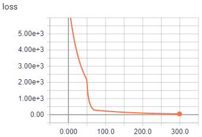
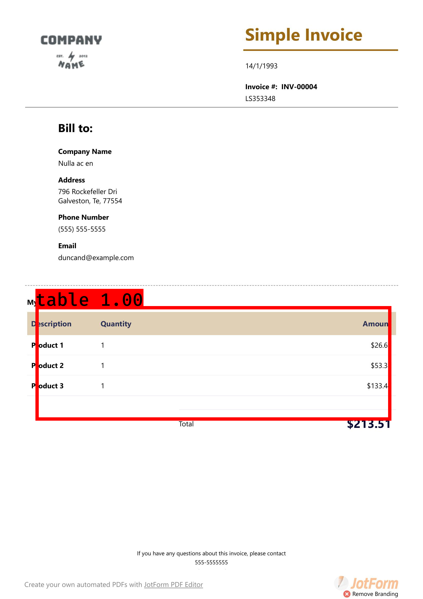
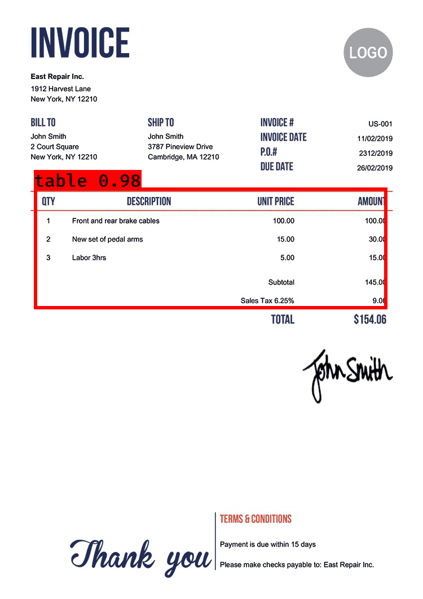

# deep-learning-for-document-table-extraction

------
## 1. Introduction
There are various tables in document that could be challenging for document scanning that utilizes traditional computer vision. Here deep-learning tool is tested for table extraction; in particular the object detection network YOLOv3 is used.

## 2. Data: about 100 images are extracted from various PDF files avaliable on government or public organizations. [LabelImg](https://github.com/tzutalin/labelImg) was used for annotation. 
      
## 3. Training
   - 
   - 

## 4. Results
   - 
   - 

## 5. Note: for this demo, the model was trained with only 100 images. 